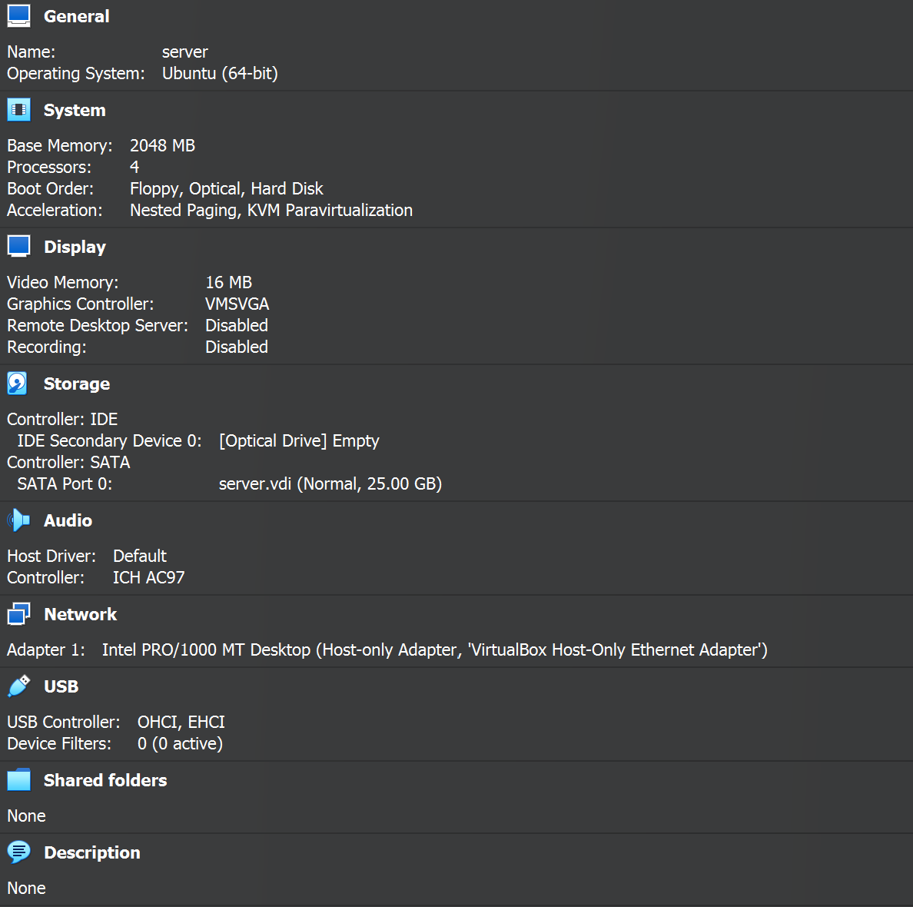
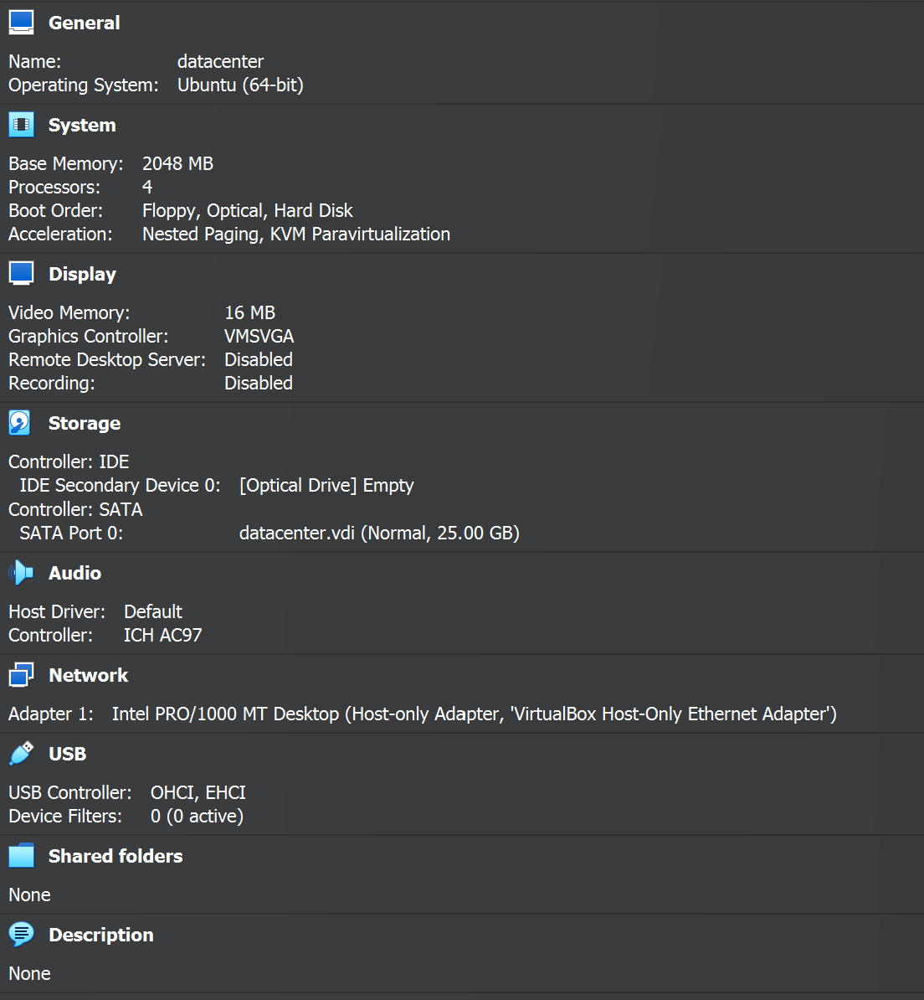

#Steps to setup : 

1) Download and install virtualbox
2) Download lubuntu : lubuntu-24.04.1-desktop-amd64.iso
3) Create 2 VMs : server and datacenter
   Configuration :
   
   
   

   Note : for downloading and building the docker image , we want the VMs to be able to access the Internet so keep network type as  : NAT
          once , this microservice is setup and its time to test , we want these VMs to communicate with each other : So , connection type = Host only

4) Install lubuntu in both VMs ( pretty standard installation ;) , keep everything default , just click next !)
5) Once the lubuntu stuff is done , dont forget to save the state of VMs)
   Do this for both VMs :
   5.1> Install docker :
   
        sudo apt update && sudo apt install -y docker.io
   
        git clone 
   
7) Now , to the main part :

6.1> Power on datacenter VM : 

a) Install Docker
   
